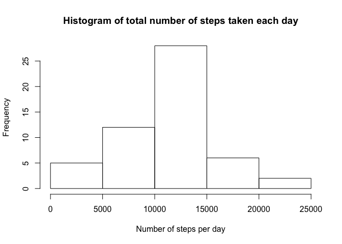
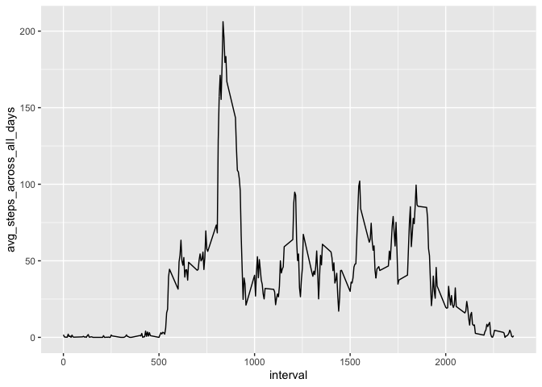
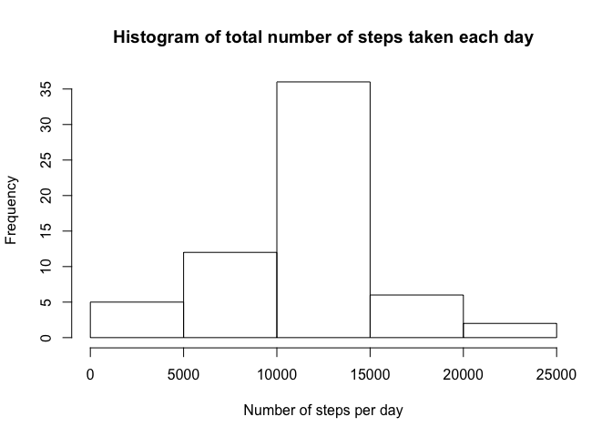
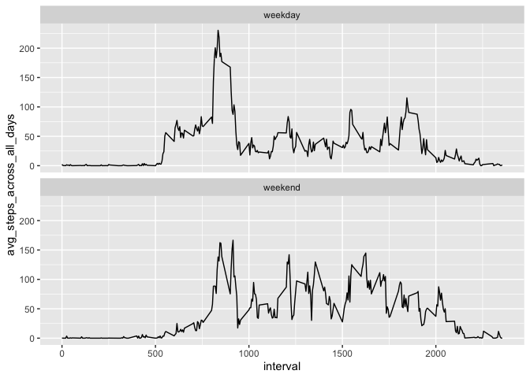

## Loading relevant libraries

```r
library(tidyverse)
```

```
## ── Attaching packages ───────────────────────────────────────────────────────────────────────────── tidyverse 1.3.0 ──
```

```
## ✓ ggplot2 3.3.0     ✓ purrr   0.3.4
## ✓ tibble  3.0.3     ✓ dplyr   0.8.5
## ✓ tidyr   1.0.0     ✓ stringr 1.4.0
## ✓ readr   1.3.1     ✓ forcats 0.4.0
```

```
## Warning: package 'tibble' was built under R version 3.6.2
```

```
## Warning: package 'purrr' was built under R version 3.6.2
```

```
## ── Conflicts ──────────────────────────────────────────────────────────────────────────────── tidyverse_conflicts() ──
## x dplyr::filter() masks stats::filter()
## x dplyr::lag()    masks stats::lag()
```

```r
library(ggplot2)
library(lubridate)
```

```
## 
## Attaching package: 'lubridate'
```

```
## The following object is masked from 'package:base':
## 
##     date
```

## Loading and preprocessing the data

```r
df <- read_csv('activity.zip')
```

```
## Parsed with column specification:
## cols(
##   steps = col_double(),
##   date = col_date(format = ""),
##   interval = col_double()
## )
```

## What is mean total number of steps taken per day?

```r
# Calculate the total number of steps taken per day
df_steps_day <- df %>% filter(!is.na(steps)) %>%
    group_by(date) %>%
    mutate(total_steps_per_day = sum(steps, na.rm = T)) %>%
    select(date, total_steps_per_day) %>%
    slice(1) %>%
    ungroup()
```


```r
# Make a histogram of the total number of steps taken each day
hist(df_steps_day$total_steps_per_day, 
        main="Histogram of total number of steps taken each day",
        xlab="Number of steps per day")
```

<!-- -->


```r
# Calculate and report the mean and median of the total number of steps taken per day
# mean -> 10766
# median -> 10765
df_steps_day %>% 
    summarise(mean = round(mean(total_steps_per_day, na.rm = T)), median = round(median(total_steps_per_day, na.rm = T)))
```

```
## # A tibble: 1 x 2
##    mean median
##   <dbl>  <dbl>
## 1 10766  10765
```

## What is the average daily activity pattern?

```r
# time series plot of the 5-minute interval (x-axis) and the average number of steps taken, averaged across all days (y-axis)
avg_daily_activity_df <- df %>% filter(!is.na(steps)) %>%  
        group_by(interval) %>%
        mutate(avg_steps_across_all_days = mean(steps)) %>%
        slice(1) %>%
        ungroup()

avg_daily_activity_df %>% ggplot(aes(x=interval, y=avg_steps_across_all_days)) +
  geom_line()
```

<!-- -->

```r
# 5-minute interval, on average across all the days in the dataset, contains the maximum number of steps
# interval at 835
avg_daily_activity_df %>% filter(avg_steps_across_all_days == max(avg_steps_across_all_days)) %>% select(interval)
```

```
## # A tibble: 1 x 1
##   interval
##      <dbl>
## 1      835
```

## Imputing missing values

```r
# total number of missing values in the dataset (i.e. the total number of rows with NAs)
# total number of rows with NAs (2304)
sum(!complete.cases(df))
```

```
## [1] 2304
```

```r
# total number of NAs (2304)
sum(is.na(df))
```

```
## [1] 2304
```

```r
# Which col NAs are at (steps)
colSums(is.na(df))
```

```
##    steps     date interval 
##     2304        0        0
```

```r
# filling in all of the missing values (steps) in the dataset by interval average
imputed_df <- df %>% group_by(interval) %>%
                      mutate(steps = ifelse(is.na(steps), mean(steps, na.rm=TRUE), steps)) %>%
                      ungroup()

# Check old and new df have same number of rows and columns

# histogram of the total number of steps taken each day

imputed_df_steps_day <- imputed_df %>%
    group_by(date) %>%
    mutate(total_steps_per_day = round(sum(steps))) %>%
    select(date, total_steps_per_day) %>%
    slice(1) %>%
    ungroup()

hist(imputed_df_steps_day$total_steps_per_day, 
        main="Histogram of total number of steps taken each day",
        xlab="Number of steps per day")
```

<!-- -->

```r
# mean and median total number of steps taken per day
# mean and median -> 10766
imputed_df_steps_day %>% 
    summarise(mean = round(mean(total_steps_per_day)), median = round(median(total_steps_per_day)))
```

```
## # A tibble: 1 x 2
##    mean median
##   <dbl>  <dbl>
## 1 10766  10766
```

```r
# Do these values differ from the estimates from the first part of the assignment? What is the impact of imputing missing data on the estimates of the total daily number of steps?
# Yes, the median now is more similar to the mean compared to before. The impact of imputing pulls the mean and median figures closer to each other. 
```
## Are there differences in activity patterns between weekdays and weekends?

```r
# Create a new factor variable in the dataset with two levels -- "weekday" and "weekend" indicating whether a given date is a weekday or weekend day.
imputed_df_day <- imputed_df %>% mutate(day = ifelse((weekdays(date)=='Saturday')| (weekdays(date)=='Sunday'),'weekend','weekday'))
imputed_df_day$day <- as.factor(imputed_df_day$day)

avg_daily_activity_imputed_df <- imputed_df_day %>%  
        group_by(day, interval) %>%
        mutate(avg_steps_across_all_days = mean(steps)) %>%
        slice(1) %>%
        ungroup()

avg_daily_activity_imputed_df %>% ggplot(aes(x = interval, y = avg_steps_across_all_days)) +
  geom_line() + 
  facet_wrap(~ day, ncol = 1) 
```

<!-- -->


